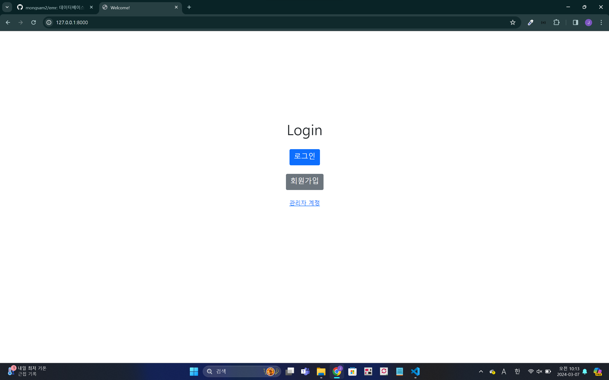
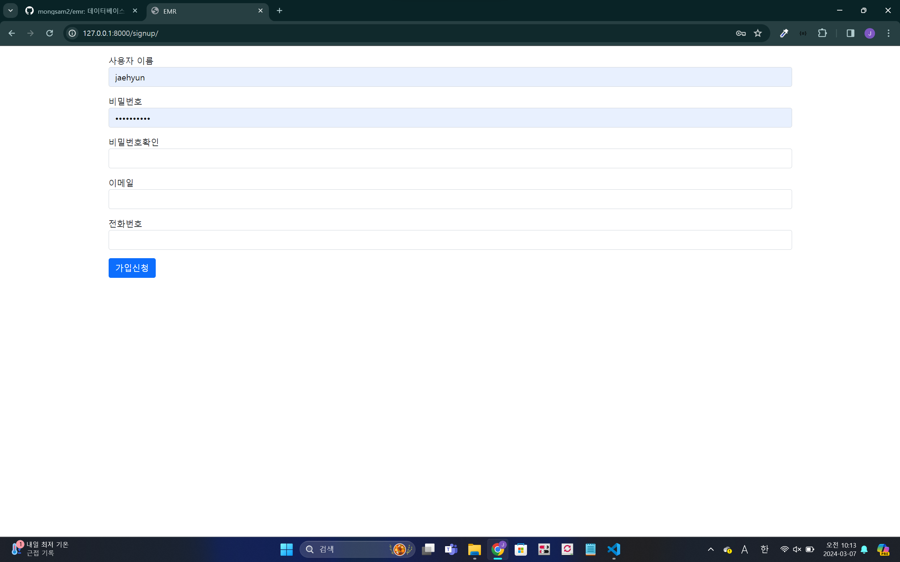
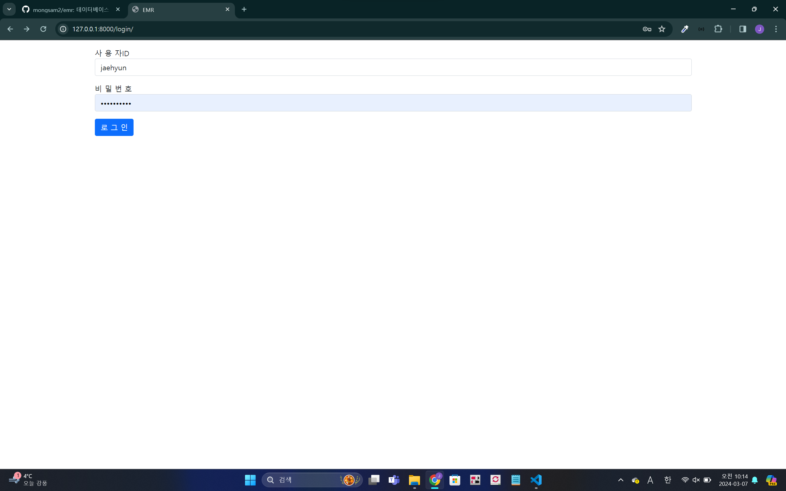
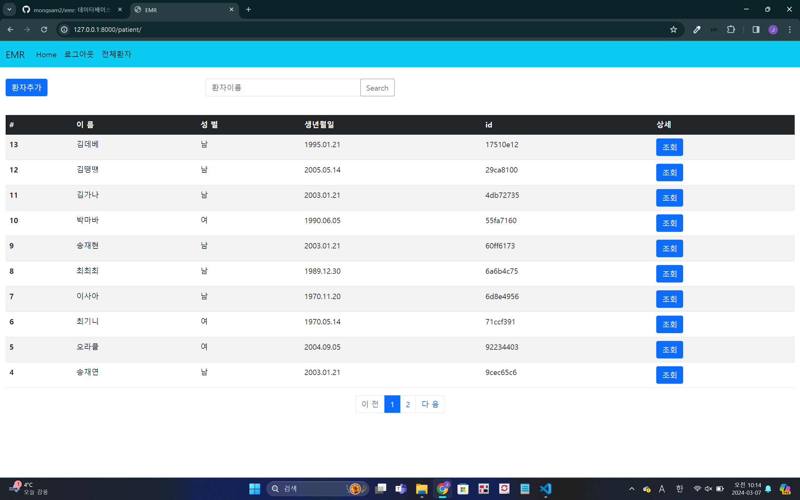
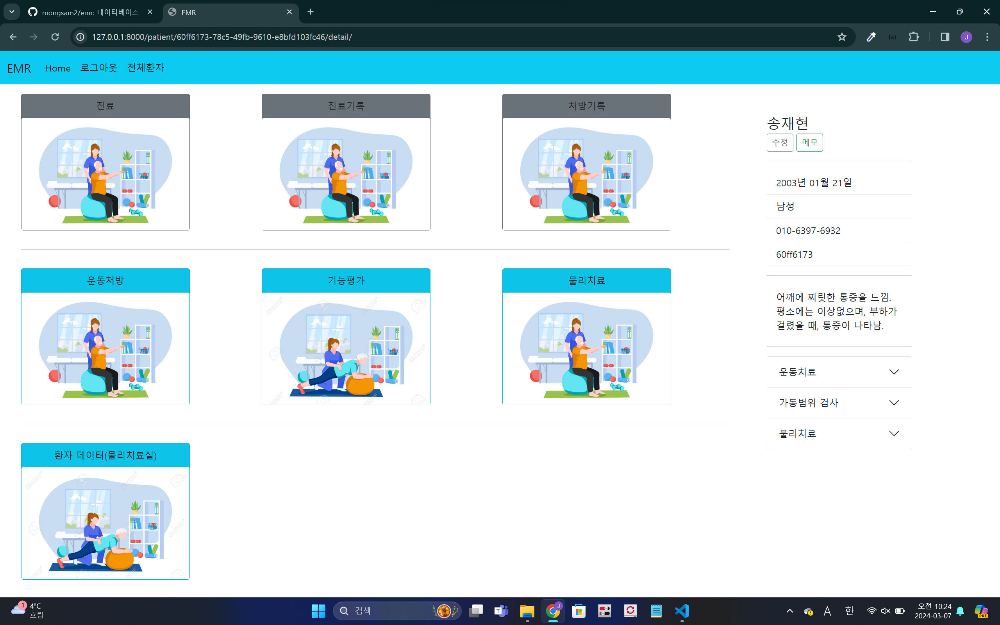
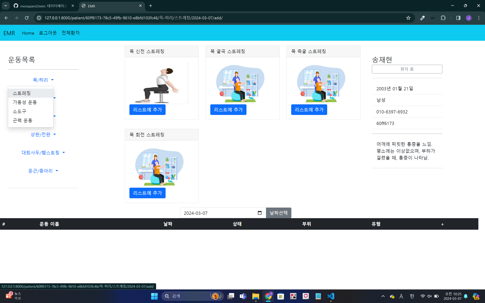
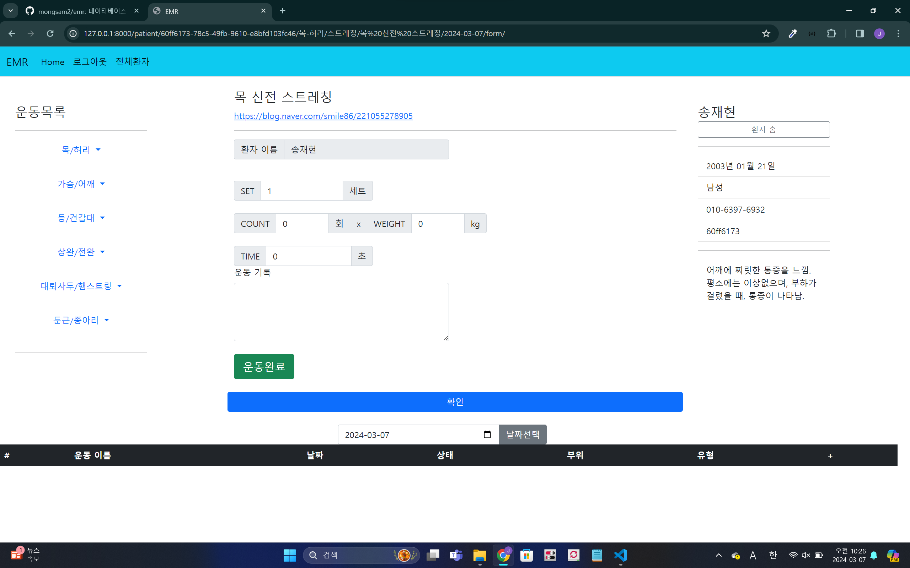

# 2023 데이터베이스 ic-pbl

## 시나리오

마취통증의학 및 재활의학과에서는 일반적인 병원 진료와 다르게 다양한 검사와 치료가 수행되고 있음
병원에서는 환자의 진료 기록을 EMR(Electronic Medical Record) 시스템을 통해서 기록하는데, 

기존의 시스템은 환자 증상, 질병, 약 처방과 같은 정보만 기록할 수 있어서 해당 과에서 기록 할 수 있는 정보가 한정적인 문제가 있음

## 문제 정의

1. 기존의 EMR은 환자의 정보를 어떻게 기록할까?
2. 재활의학과에서 실시하는 검사에는 어떤 것들이 있을까?
3. 재활의학과에서는 환자의 기능 개선을 위해 운동을 처방을 내리는데 어떻게 기록할 것인가?

## 자료조사

### 기존 EMR의 화면 구성

(닥터팔레트)

### 재활의학과에서 실시하는 기능평가들

ROM: 관절가동범위평가

MMT: 도수근력평가

### 많은 운동들을 분류하는 기준

가슴, 어깨, 등, 종아리 등, 부위별로 분류

스트레칭, 가동성 운동, 소도구 운동, 근력 운동으로 분류

# 재활의학과 EMR 웹사이트
### 2023-2학기 데이터베이스 ic-pbl 프로젝트      
 
<h3>시작 페이지</h3>

<h3>회원 가입</h3>

<li>회원가입 대상은 EMR을 사용하는 의사들입니다.</li>

<h3>로그인</h3>

<h3>메인 페이지</h3>

<h3>환자 리스트</h3>

<li>"환자추가" 버튼을 눌러 환자를 새로 추가할 수 있습니다.</li>
<li>환자이름으로 환자를 검색할 수 있습니다.</li> 
<li>"조회" 버튼을 눌러 환자 상세 정보를 확인할 수 있습니다.</li>

<h3>환자 페이지</h3>

<li>"조회" 버튼을 누르면 나타나는 페이지 입니다.</li>
<li>운동 처방, 가동범위 검사, 데이터 조회를 할 수 있으며, 환자 기본정보와 메모를 작성 및 확인할 수 있습니다.</li> 

<h3>운동 처방</h3>

<li>환자의 운동 계획을 세우고, 운동 처방을 내릴 수 있는 페이지입니다.</li>
<li>운동들은 운동 부위와 종류에 따라 분류되어있습니다.</li> 

<h3>운동 추가</h3>

<li>세트 수, 횟수, 무게, 시간 등을 작성하여 환자의 운동을 기록합니다.</li>

<h3>운동기록 조회</h3>

<li>선택한 날짜에 진행한 운동들과 수행 여부를 확인할 수 있습니다.</li>

<h3>가동범위 검사</h3>

<li>운동 전 가동범위 평가, 환자의 기능 개선 정도를 평가하는데 활용할 수 있습니다.</li>

<h3>환자의 운동 데이터</h3>

<li>환자가 운동한 부위의 비율과 운동 종류의 비율을 확인할 수 있습니다.</li>

<li>운동별로 기록의 변화를 확인할 수 있습니다.</li>

<h3>환자의 가동범위 데이터</h3>

<li>환자 가동범위의 변화량을 확인할 수 있습니다.</li>
